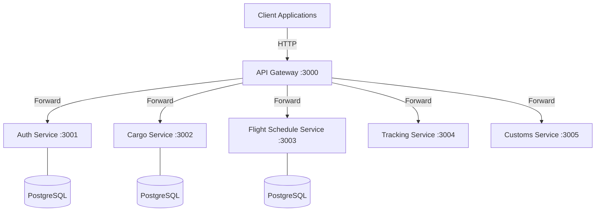

# Airport Cargo Risk - Delay Prediction System Backend

A microservices-based backend system for predicting and managing risks and delays in airport cargo operations.

## 🏗 System Architecture

The system is built using a microservices architecture, with each service responsible for a specific domain. An API Gateway serves as the single entry point for all client requests.



## 🛠 Technology Stack

- **Runtime**: Node.js
- **Framework**: Express.js
- **Language**: TypeScript
- **ORM**: Prisma
- **Database**: PostgreSQL
- **Documentation**: Swagger/OpenAPI
- **Validation**: Joi
- **Security**: JWT, Bcrypt, Helmet

## 📁 Project Structure

| Service | Path | Port | Description |
|---------|------|------|-------------|
| **API Gateway** | [`/api-gateway`](./api-gateway) | 3000 | Central routing and entry point. |
| **Auth Service** | [`/auth-service`](./auth-service) | 3001 | User authentication and RBAC. |
| **Cargo Service** | [`/cargo-service`](./cargo-service) | 3002 | Cargo management and tracking. |
| **Flight Service** | [`/flight-schedule-service`](./flight-schedule-service) | 3003 | Flight schedules and delay reporting. |

## 🚀 Getting Started

### Prerequisites

- Node.js (v18+)
- pnpm or npm
- PostgreSQL database

### Global Setup

1. **Clone the repository**:
   ```bash
   git clone <repo-url>
   cd mtit
   ```

2. **Install dependencies for all services**:
   ```bash
   # In each service directory
   cd api-gateway && pnpm install
   cd ../auth-service && pnpm install
   cd ../cargo-service && pnpm install
   cd ../flight-schedule-service && pnpm install
   ```

3. **Configure Environment Variables**:
   Each service requires its own `.env` file. Copy the `.env.example` in each directory and update the `DATABASE_URL` and other secrets.

4. **Database Migrations**:
   Run Prisma migrations for services that use a database:
   ```bash
   cd auth-service && npx prisma migrate dev
   cd ../cargo-service && npx prisma migrate dev
   cd ../flight-schedule-service && npx prisma migrate dev
   ```

### Running the Services

You can start each service in a separate terminal:

```bash
# Terminal 1: API Gateway
cd api-gateway && pnpm run dev

# Terminal 2: Auth Service
cd auth-service && pnpm run dev

# Terminal 3: Cargo Service
cd cargo-service && pnpm run dev

# Terminal 4: Flight Schedule Service
cd flight-schedule-service && pnpm run dev
```

## 🔐 Security

- **Authentication**: JWT-based (issued by Auth Service)
- **Authorization**: Role-Based Access Control (OPERATIONS, CARGO, CUSTOMS, ADMIN)
- **Middleware**: Request logging, error handling, and security headers (Helmet)

## 📖 API Documentation

Each service provides its own Swagger documentation:
- API Gateway: `http://localhost:3000/gateway/info`
- Cargo Service: `http://localhost:3002/api-docs`
- Flight Service: `http://localhost:3003/api-docs`

---
© 2026 Airport Cargo Risk - Delay Prediction System
